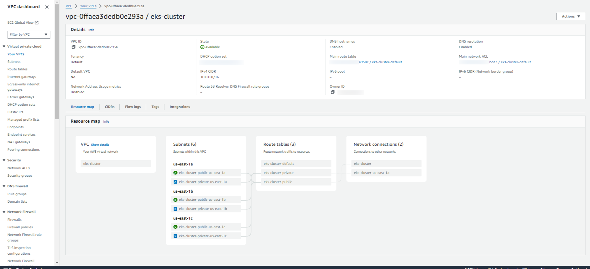

# terraform-eks-karpenter

Step-by-step guide to set and use AWS EKS with Karpenter by Terraform.

## Steps

Install below tools before starting

- [AWS CLI](https://docs.aws.amazon.com/cli/latest/userguide/getting-started-install.html)
- [Terraform](https://developer.hashicorp.com/terraform/tutorials/aws-get-started/install-cli)

Configure your AWS profile with appropriate credentials with `Admin` access.
Set the aws profile in your CLI, i.e.

```
export AWS_DEFAULT_PROFILE=<your_aws_profile_name>
```

Clone this repository to your local machine

```
git clone https://github.com/ahmadalsajid/terraform-eks-karpenter.git
```

Change directory to [infra](./infra) and update the
[variables.tf](./infra/variables.tf) and [local.tf](./infra/local.tf)
accordingly. Check the plan and initiate apply to create the VPC.

```
terraform init
terraform plan

terraform apply -target="module.vpc" -auto-approve
terraform apply -target="module.eks" -auto-approve
terraform apply --auto-approve
```

Check the AWS console for the newly created VPC


Always delete the AWS resources to save money after you are done.

```
terraform destroy
```

## Tasks

| **Task ID** | **Details**                                             | **Status**         | **Comment(s)**             |
|-------------|---------------------------------------------------------|--------------------|----------------------------|
| Task-1      | Create VPC for EKS cluster                              | :white_check_mark: |                            |
| Task-2      | Create EKS Cluster with Karpenter for node scaling      | :x:                |                            |
| Task-3      | Deploy Stateless application                            | :x:                |                            |
| Task-4      | ALB Ingress for access from the internet                | :x:                |                            |
| Task-5      | Prometheus Grafana integration for monitoring           | :x:                |                            |
| Task-6      | ConfigMap and Secrets                                   | :x:                |                            |
| Task-7      | ConfigMap and Secrets                                   | :x:                | [with AWS parameter store] |
| Task-8      | Deploy DaemonSet                                        | :x:                |                            |
| Task-9      | Deploy Stateful Application                             | :x:                |                            |
| Task-10     | Create Admin and Developer accounts for granular access | :x:                |                            |
| Task-11     | To be amended in the future                             | :x:                |                            |


## References
- [karpenter-blueprints](https://github.com/aws-samples/karpenter-blueprints/tree/main)